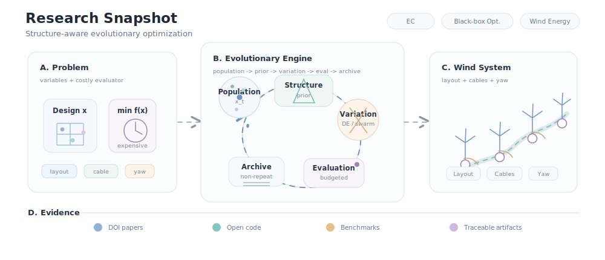

# Baohang Zhang

**Ph.D. in Engineering, University of Toyama, Japan** 
Degree awarded in March 2026

[Email](mailto:zbhsyx@163.com) | [Google Scholar](https://scholar.google.com.hk/citations?user=kKfWIUkAAAAJ&hl=zh-CN) | [ORCID](https://orcid.org/0000-0002-8612-0649) | [GitHub](https://github.com/zbh0528)

 

 

<b>斑斑</b> keeps the research loop moving. 
虽然他去了鼠星，但我很想他。

---

## Research Overview

I received the **Ph.D. degree in Engineering** from the **University of Toyama, Japan**, in **March 2026**.

I study **evolutionary computation**, **expensive optimization**, and **wind energy optimization**, with a focus on optimization methods that remain reliable when evaluations are costly, design variables are coupled, and engineering constraints are explicit.

My current work connects structure-aware evolutionary search with offshore wind farm layout optimization, electrical cable routing, wake-aware yaw control, feature selection, and reproducible engineering benchmarks.

**Main question:** How can evolutionary search remain reliable under limited evaluation budgets and real engineering constraints?

---

## Research Map

Constrained problem space -> evolutionary search -> engineering evaluation -> reproducible evidence.

---

## Selected Publications

**Journal articles**

1. **Baohang Zhang**, Yixin Shao, Zhenyu Lei, Chao Zhang, Yirui Wang, and Shangce Gao, 
   **[A geometry-guided genetic algorithm for integrated offshore wind farm layout and electrical cable routing optimization](https://doi.org/10.1016/j.apenergy.2026.127895)**, 
   *Applied Energy*, vol. 415, Article 127895, July 2026. DOI: [`10.1016/j.apenergy.2026.127895`](https://doi.org/10.1016/j.apenergy.2026.127895)

2. Zhe Xu, Lin Yang, Fenggang Yuan, **Baohang Zhang**, Jiatianyi Yu, and Xiaosha Qi, 
   **[Dendritic Learning Empowered by Diversity-Aware Differential Evolution](https://doi.org/10.1109/ACCESS.2026.3669958)**, 
   *IEEE Access*, vol. 14, pp. 34879-34893, 2026. DOI: [`10.1109/ACCESS.2026.3669958`](https://doi.org/10.1109/ACCESS.2026.3669958)

3. **Baohang Zhang**, Ziqian Wang, Haotian Li, Zhenyu Lei, Jiujun Cheng, and Shangce Gao, 
   **[Information gain-based multi-objective evolutionary algorithm for feature selection](https://doi.org/10.1016/j.ins.2024.120901)**, 
   *Information Sciences*, vol. 677, Article 120901, August 2024. DOI: [`10.1016/j.ins.2024.120901`](https://doi.org/10.1016/j.ins.2024.120901)

4. **Baohang Zhang**, Haichuan Yang, Tao Zheng, Rong-Long Wang, and Shangce Gao, 
   **[A Non-Revisiting Equilibrium Optimizer Algorithm](https://doi.org/10.1587/transinf.2022EDP7119)**, 
   *IEICE Transactions on Information and Systems*, vol. E106-D, no. 3, pp. 365-373, 2023. DOI: [`10.1587/transinf.2022EDP7119`](https://doi.org/10.1587/transinf.2022EDP7119)

**Conference papers**

1. Tao Zheng, Zhiwei Yu, Kefan Ni, **Baohang Zhang**, Zhenyu Lei, and Shangce Gao, 
   **[Revolutionizing Wind Energy: A Compact Evolutionary Algorithm for Layout Optimization](https://doi.org/10.1145/3766671.3766786)**, 
   *EITCE 2025*, pp. 667-672. DOI: [`10.1145/3766671.3766786`](https://doi.org/10.1145/3766671.3766786)

2. Jiatianyi Yu, **Baohang Zhang**, Qianhang Du, Wenshui Wang, Zhenyu Lei, and Shangce Gao, 
   **[A Novel Adaptive LSHADE Algorithm for Wind Farm Layout Optimization with Complex Wake Effect](https://doi.org/10.1109/PIC62406.2024.10892732)**, 
   *IEEE PIC 2024*, pp. 162-165. DOI: [`10.1109/PIC62406.2024.10892732`](https://doi.org/10.1109/PIC62406.2024.10892732)

---

## Current Work

- Structure-aware evolutionary algorithms for wind energy systems
- Expensive black-box optimization under limited evaluation budgets
- Integrated offshore wind farm layout and cable routing optimization
- Wake-aware yaw optimization with coupled variables
- Reproducible optimization workflows for engineering applications

---

## Open Repositories

- [WFLO-GGA](https://github.com/zbh0528/WFLO-GGA) 
  Geometry-guided optimization for integrated offshore wind farm layout and cable routing.

- [Mass and momentum conserving analytical wake model](https://github.com/zbh0528/Mass--and-momentum-conserving-analytical-wake-model) 
  Analytical wake modeling for wind farm analysis and optimization.

---

`Evolutionary Computation` | `Expensive Optimization` | `Wind Energy Optimization`

